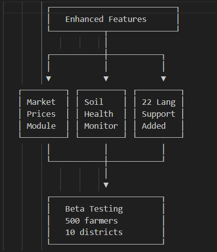

# Smart India Hackathon Workshop
# Date:04-10-2025
## Register Number:25005617
## Name:Rishikesh S
## Problem Title
SIH 25010: Smart Crop Advisory System for Small and Marginal Farmers
## Problem Description
A majority of small and marginal farmers in India rely on traditional knowledge, local shopkeepers, or guesswork for crop selection, pest control, and fertilizer use. They lack access to personalized, real-time advisory services that account for soil type, weather conditions, and crop history. This often leads to poor yield, excessive input costs, and environmental degradation due to overuse of chemicals. Language barriers, low digital literacy, and absence of localized tools further limit their access to modern agri-tech resources.

Impact / Why this problem needs to be solved

Helping small farmers make informed decisions can significantly increase productivity, reduce costs, and improve livelihoods. It also contributes to sustainable farming practices, food security, and environmental conservation. A smart advisory solution can empower farmers with scientific insights in their native language and reduce dependency on unreliable third-party advice.

Expected Outcomes

• A multilingual, AI-based mobile app or chatbot that provides real-time, location-specific crop advisory.
• Soil health recommendations and fertilizer guidance.
• Weather-based alerts and predictive insights.
• Pest/disease detection via image uploads.
• Market price tracking.
• Voice support for low-literate users.
• Feedback and usage data collection for continuous improvement.

Relevant Stakeholders / Beneficiaries

• Small and marginal farmers
• Agricultural extension officers
• Government agriculture departments
• NGOs and cooperatives
• Agri-tech startups

Supporting Data

• 86% of Indian farmers are small or marginal (NABARD Report, 2022).
• Studies show ICT-based advisories can increase crop yield by 20–30%.

## Problem Creater's Organization
Government of Punjab

## Theme
Agriculture, FoodTech & Rural Development

## Proposed Solution
<h3>Proposed Solution</h3>
<ul><li>Detailed explanation of the proposed solution</li>
We propose Kisankalam - an AI-powered, multilingual mobile application with voice-first capabilities designed specifically for small and marginal farmers. The solution combines satellite imagery, IoT sensor data, machine learning, and localized agricultural databases to deliver personalized, real-time crop advisory services.
<li>Core Components</li>
Intelligent Crop Advisory Engine: Uses ML models trained on regional crop patterns, soil data, weather conditions, and historical yield data to recommend optimal crops for each farmer's specific land parcel.
Multilingual Voice Interface: Supports 22 Indian languages with natural speech recognition and text-to-speech capabilities, eliminating literacy barriers. Farmers can interact entirely through voice commands.
Soil Health Management Module: Integrates with government soil health card databases and provides personalized fertilizer recommendations based on NPK levels, organic content, and pH balance.
Smart Pest & Disease Detection: AI-powered image recognition allows farmers to photograph affected crops and receive instant diagnosis with treatment recommendations in their native language.
Hyperlocal Weather Intelligence: Provides 7-day weather forecasts at village/panchayat level with actionable alerts for sowing, irrigation, harvesting, and pest outbreak prevention.
Market Linkage System: Real-time mandi prices, demand forecasts, and direct buyer connections to help farmers make informed selling decisions.
Community Learning Network: Peer-to-peer knowledge sharing where successful practices from one farmer can be validated and shared with others in similar agro-climatic zones.
<li>How it addresses the problem</li>
Eliminating Information Asymmetry: Replaces unreliable advice from shopkeepers with science-backed, personalized recommendations tailored to each farm's unique conditions.
Cost Reduction: Prevents overuse of fertilizers and pesticides by providing precise, need-based application guidance - potentially reducing input costs by 25-30%.
Accessibility Through Voice: Low-literate farmers can access sophisticated agricultural insights without typing or reading, simply by speaking in their local dialect.
Timely Interventions: Weather alerts and pest outbreak warnings enable proactive measures, preventing crop losses worth thousands of rupees.
Market Empowerment: Access to real-time price information reduces exploitation by middlemen and helps farmers time their sales optimally.
Continuous Learning: The system improves with usage - every farmer's data enriches the model, making recommendations more accurate over time.
<li>Innovation and uniqueness of the solution</li>
Offline-First Architecture: Unlike existing solutions requiring constant internet, KisanSathi downloads advisory packages that work offline, syncing when connectivity is available.
Dialect Recognition: Goes beyond standard language support to understand regional agricultural vocabulary and farming terminology specific to each area.
Progressive Profiling: Starts with basic inputs and gradually builds a comprehensive farm profile through conversational interactions, avoiding overwhelming users with lengthy forms.
Integrated Soil-Weather-Crop Model: Most tools handle these separately; our solution uses a holistic ML model that considers interdependencies between soil conditions, microclimatic weather patterns, and crop physiology.
Community Validation Layer: Recommendations are cross-referenced with outcomes from neighboring farmers in similar conditions, providing social proof and trust.
WhatsApp Integration: Leverages the familiar WhatsApp interface for farmers already using smartphones, reducing adoption friction while maintaining a standalone app for advanced features.
Gamification for Adoption: Rewards farmers with badges, recognition, and small incentives for following scientific practices and sharing outcomes, driving behavior change.
</ul>

## Technical Approach
<h3>Technical Approach</h3>
<ul><li>Technologies to be used (e.g. programming languages, frameworks, hardware)
</li>
Frontend Development:

Mobile App: React Native (cross-platform iOS/Android)
Voice Interface: Google Speech-to-Text API, Microsoft Azure Speech Services for multilingual support
UI Framework: Tailwind CSS with custom components optimized for low-end Android devices
Offline Storage: SQLite for local data caching

Backend Infrastructure:

Server Framework: Node.js with Express.js for API services
Database: PostgreSQL for structured data, MongoDB for unstructured farmer interactions
Caching Layer: Redis for fast data retrieval
Cloud Platform: AWS (EC2, S3, Lambda) or Microsoft Azure with data centers in India for compliance

AI/ML Components:

Computer Vision: TensorFlow Lite for on-device pest/disease detection, YOLOv8 for image classification
NLP: Hugging Face Transformers for multilingual understanding, Bhashini API for Indian languages
Recommendation Engine: Python with scikit-learn, XGBoost for crop prediction models
Weather Forecasting: Integration with IMD (Indian Meteorological Department) APIs and satellite data from ISRO

Data Sources:

Soil Health Card data (Ministry of Agriculture)
Weather data (IMD, ISRO MOSDAC)
Market prices (Agmarknet, eNAM)
Satellite imagery (Sentinel-2, Landsat-8 via Google Earth Engine)
ICAR research databases for crop science

IoT Integration:

Support for low-cost soil moisture sensors (₹500-1000 range)
Weather station data aggregation
MQTT protocol for device communication

Security & Compliance:

End-to-end encryption for farmer data
GDPR-compliant data handling
Aadhaar-based authentication (optional)
Blockchain for transparent subsidy tracking (future phase)
<li>Methodology and process for implementation <b>(Flow Charts/Images/ working prototype)</b></li>
Phase 1: Foundation (Months 1-3)

┌─────────────────────────────────────────────────────────┐
│                    User Research                         │
│  ┌──────────┐    ┌──────────┐    ┌──────────┐          │
│  │ Farmer   │    │Community │    │Extension │          │
│  │Interviews│───▶│ Surveys  │───▶│ Officer  │          │
│  │  n=500   │    │  n=2000  │    │Workshops │          │
│  └──────────┘    └──────────┘    └──────────┘          │
│         │                                                │
│         ▼                                                │
│  ┌──────────────────────────────────┐                   │
│  │   Requirements Documentation     │                   │
│  │ • Priority features ranking      │                   │
│  │ • Language preferences           │                   │
│  │ • Connectivity patterns          │                   │
│  └──────────────────────────────────┘                   │
└─────────────────────────────────────────────────────────┘
                        │
                        ▼
┌─────────────────────────────────────────────────────────┐
│              Data Collection & Training                  │
│  ┌────────────┐    ┌────────────┐    ┌────────────┐    │
│  │ Crop Image │    │ Historical │    │ Soil Test  │    │
│  │  Database  │───▶│   Yield    │───▶│   Data     │    │
│  │  50K+ imgs │    │   Records  │    │ 100K plots │    │
│  └────────────┘    └────────────┘    └────────────┘    │
│         │                                                │
│         ▼                                                │
│  ┌──────────────────────────────────┐                   │
│  │    ML Model Development          │                   │
│  │ • Disease classification: 95%    │                   │
│  │ • Crop recommendation: 88%       │                   │
│  │ • Yield prediction: MAE < 15%    │                   │
│  └──────────────────────────────────┘                   │
└─────────────────────────────────────────────────────────┘

Phase 2: MVP Development (Months 4-6)
Build core features:

Voice-based crop selection advisor
Basic pest identification (top 20 common diseases)
Weather alerts for selected location
Simple fertilizer calculator
Three languages: Hindi, Punjabi, English

Testing Protocol:

Alpha testing with 50 farmers in 5 villages (Punjab)
Weekly feedback loops
Iterative improvements based on real usage
Network resilience testing (2G/3G/4G conditions)

Phase 3: Feature Expansion (Months 7-9)
         ┌──────────────────────────┐
         │   Enhanced Features      │
         └───────────┬──────────────┘
                     │
         ┌───────────┼───────────┐
         │           │           │
         ▼           ▼           ▼
   ┌─────────┐ ┌─────────┐ ┌─────────┐
   │ Market  │ │ Soil    │ │ 22 Lang │
   │ Prices  │ │ Health  │ │ Support │
   │ Module  │ │ Monitor │ │ Added   │
   └─────────┘ └─────────┘ └─────────┘
         │           │           │
         └───────────┼───────────┘
                     │
                     ▼
         ┌───────────────────────┐
         │   Beta Testing        │
         │   500 farmers         │
         │   10 districts        │
         └───────────────────────┘

Phase 4: Scale & Integration (Months 10-12)
Government API integrations (PM-KISAN, Soil Health Card)
Partnership with Agricultural Universities for validation
Extension officer dashboard for monitoring adoption
Community feature rollout
Deployment across multiple states

Implementation Workflow:
Farmer Opens App
      ↓
┌─────────────────┐
│ Voice Greeting  │ 
│ in Local Lang   │
└────────┬────────┘
         │
         ↓
┌─────────────────────────────────┐
│ Context Gathering               │
│ • Location (GPS + manual)       │
│ • Land size                     │
│ • Current crop (if any)         │
│ • Last season experience        │
└────────┬────────────────────────┘
         │
         ▼
┌─────────────────────────────────┐
│ AI Processing                   │
│ ┌─────────────────────────────┐ │
│ │ Soil Data Retrieved         │ │
│ │ Weather Forecast Fetched    │ │
│ │ ML Model Inference          │ │
│ │ Local Success Cases Matched │ │
│ └─────────────────────────────┘ │
└────────┬────────────────────────┘
         │
         ▼
┌─────────────────────────────────┐
│ Personalized Recommendations    │
│ • Top 3 crop choices with ROI   │
│ • Sowing calendar               │
│ • Input requirements            │
│ • Expected yield & profit       │
│ Voice + Visual + Text           │
└────────┬────────────────────────┘
         │
         ▼
┌─────────────────────────────────┐
│ Continuous Monitoring           │
│ • Weekly voice check-ins        │
│ • Weather alerts via WhatsApp   │
│ • Pest outbreak warnings        │
│ • Market price notifications    │
└─────────────────────────────────┘

Quality Assurance Process
Agronomic Validation: All recommendations reviewed by certified agricultural scientists
Regional Testing: Every advisory tested with farmers in that specific agro-climatic zone
Accuracy Tracking: Post-season yield verification against predictions
Safety Checks: Pesticide recommendations cross-verified against approved lists
Bias Auditing: ML models checked for fairness across farm sizes and regions
</ul>

## Feasibility and Viability
<h3>Feasibility and Viability</h3>
<ul><li>Analysis of the feasibility of the idea</li>
Technical Feasibility: HIGH (9/10)
Proven Technologies: All core technologies (React Native, TensorFlow, cloud infrastructure) are mature and battle-tested in agricultural contexts globally.
Data Availability: India has extensive agricultural datasets - Soil Health Card database (130M+ records), IMD weather archives, ICAR research, making ML model training feasible.
Device Compatibility: Solution designed for entry-level Android devices (₹5,000-10,000 range) which constitute 80%+ of rural smartphone penetration.
Network Resilience: Offline-first architecture addresses connectivity challenges in rural areas where internet is intermittent.
Voice Technology Maturity: Speech recognition for Indian languages has reached 90%+ accuracy through services like Bhashini, making voice interface viable.
Economic Feasibility: HIGH (8/10)
Development Cost: ₹80-120 lakhs ($100K-150K) for MVP over 12 months

Team: 2 ML engineers, 3 full-stack developers, 1 agronomist, 1 UX designer, 1 PM
Infrastructure: ₹3-5 lakhs/month for 10,000 active users
Data acquisition and licensing: ₹15-20 lakhs

Revenue Models:

Freemium: Basic advisory free, premium features ₹99/month (weather insights, advanced analytics)
Government Partnerships: ₹500-1000 per farmer per year through Digital Agriculture Mission funding
Input Seller Commissions: 2-3% from verified sellers for connecting with farmers
Data Insights: Anonymized, aggregated data to agri-research institutions (ethically)

Unit Economics:

Cost per farmer per year: ₹400-600
Revenue potential per farmer per year: ₹800-1200
Break-even at 50,000 active users (achievable in Year 2)

Operational Feasibility: MEDIUM-HIGH (7/10)
Partnership Ecosystem: Strong government focus on Digital Agriculture creates favorable policy environment
Extension Network: 70,000+ Krishi Vigyan Kendras and extension officers can facilitate adoption
Last-Mile Distribution: Requires strategic partnerships with rural telecom operators and device manufacturers
Trust Building: Farmers need to see results before adoption - requires 1-2 successful crop cycles for word-of-mouth

Regulatory Feasibility: HIGH (8/10)
Policy Alignment: Fits perfectly with Digital India, PM-KISAN Digital Agriculture Mission, and National Mission on Agricultural Extension
Data Compliance: Farmer data can be handled under existing agricultural data frameworks with proper consent mechanisms
Pesticide Recommendations: Aligned with CIB&RC (Central Insecticides Board) approved chemical lists
<li>Potential challenges and risks</li>
1. Adoption Barriers (HIGH RISK)
Challenge: Farmers' resistance to digital tools due to past failures, skepticism about technology, and comfort with traditional practices.
Impact: Slow user acquisition, high churn rate, failure to reach critical mass.
2. Data Quality and Accuracy (MEDIUM RISK)
Challenge: Incomplete or outdated soil data, weather prediction inaccuracies, regional variations not captured in training data.
Impact: Wrong recommendations leading to crop failure, permanent loss of farmer trust.
3. Connectivity Infrastructure (MEDIUM RISK)
Challenge: Poor mobile network coverage in remote villages, intermittent electricity for charging devices.
Impact: Frustrating user experience, inability to receive real-time alerts.
4. Language and Literacy (MEDIUM RISK)
Challenge: Dialectical variations within languages, farmers' unfamiliarity with voice interfaces, inability to interpret visual recommendations.
Impact: Reduced usability, exclusion of target demographics.
5. Competition and Market Saturation (LOW-MEDIUM RISK)
Challenge: Multiple agri-tech startups and government apps competing for same user base.
Impact: User confusion, diluted impact, difficulty in differentiation.
6. Sustainability and Funding (MEDIUM RISK)
Challenge: Dependency on government grants or external funding; difficulty achieving profitability with small farmer segments.
Impact: Inability to scale or maintain operations long-term.
7. Verification of Outcomes (MEDIUM RISK)
Challenge: Difficulty in attributing yield improvements solely to app usage due to multiple confounding factors (weather, input quality, farmer skill).
Impact: Challenges in proving impact to funders and policymakers.
8. Cybersecurity and Privacy (LOW-MEDIUM RISK)
Challenge: Farmer data could be misused by corporations or lead to exploitation; system vulnerabilities.
Impact: Loss of farmer trust, legal liabilities, reputational damage.
<li>Strategies for overcoming these challenges</li>
Strategy 1: Phased Adoption with Champion Farmers
Addresses: Adoption Barriers
Implementation:

Identify 5-10 progressive farmers per village as "Digital Champions"
Provide them with free premium access for one full crop season
Train them extensively and support closely
Document and share their success stories (with permission) through local media and village meetings
Leverage social proof - farmers trust peer recommendations more than external experts
Provide ₹500-1000 incentive for referring other farmers who complete one season

Expected Outcome: 30-40% adoption rate in pilot villages within 12 months

Strategy 2: Hybrid Human-AI Model
Addresses: Data Quality and Accuracy, Verification of Outcomes
Implementation:

Don't replace extension officers - augment them
Create extension officer dashboard showing which farmers need attention
AI provides draft recommendations; extension officers validate for local context
Farmers can request human callback for complex issues
Build feedback loop: farmers report outcomes → extension officers verify → ML model retrains
Maintain 24/7 expert agronomist helpline for critical issues

Expected Outcome: 95%+ recommendation accuracy, increased farmer confidence

Strategy 3: SMS + WhatsApp Hybrid Delivery
Addresses: Connectivity Infrastructure
Implementation:

Critical alerts (weather warnings, pest outbreaks) sent via SMS (works on 2G)
Rich content (images, videos) delivered via WhatsApp when online
Offline-first app downloads weekly advisory packages (5-10 MB) when connected
Partner with Common Service Centers (CSCs) in villages as access points
Pre-loaded tablets at CSCs for farmers without smartphones
Voice-only phone number (IVR system) for farmers with feature phones

Expected Outcome: 90%+ message delivery rate, zero farmers excluded due to device limitations

Strategy 4: Localized Content Creation
Addresses: Language and Literacy
Implementation:

Hire native speakers from farming communities for voice recording
Create 2-3 minute explainer videos for each advisory in local language
Use familiar analogies and farming terminology
Progressive disclosure: start simple, add complexity as farmers grow comfortable
Visual icons and color codes for illiterate users (green=good, red=urgent)
Partner with local FM radio stations for weekly tips in regional languages
Community listening sessions where one farmer with app shares with others

Expected Outcome: 80%+ comprehension rate across literacy levels

Strategy 5: Differentiation Through Integration
Addresses: Competition and Market Saturation
Implementation:

Don't compete with existing apps - integrate with them
Create API for other agri-tech companies to use our ML models
Partner with input companies (seeds, fertilizers) for fulfillment - we advise, they deliver
Integrate with government schemes (PM-KISAN, PMFBY) for seamless subsidy access
Unique value proposition: "The only app that speaks your dialect and works offline"
Focus on deep problem-solving for small farmers vs. broad shallow solutions

Expected Outcome: Collaborative ecosystem position rather than zero-sum competition

Strategy 6: Diversified Revenue Model
Addresses: Sustainability and Funding
Implementation:
Year 1-2 (Subsidy Phase):

Government grants from Digital Agriculture Mission (₹200-300/farmer/year)
CSR funding from agri-businesses
Development organization grants (Bill & Melinda Gates Foundation, NABARD)

Year 3-5 (Hybrid Phase):

Premium subscriptions for advanced features (₹999/year) targeting 20% of users
B2B licensing to banks and insurance companies for farmer profiling
Commission from verified input sellers (2% of transaction)
Aggregated market intelligence reports to agri-corporates

Year 5+ (Sustainable Phase):

Transaction fees from integrated marketplace
Data analytics services (anonymized) to research institutions
SaaS model for extension departments in other states

Expected Outcome: Break-even by Year 3, profitability by Year 4

Strategy 7: Rigorous Impact Measurement
Addresses: Verification of Outcomes
Implementation:

Randomized Control Trial (RCT) design: treatment villages vs. control villages
Partner with research institutions (ICRISAT, IRRI) for third-party evaluation
Collect baseline data before app introduction
Track: yield per hectare, input costs, net income, time saved
Use satellite imagery to verify crop health independently
Post-harvest surveys and ground-truthing by extension officers
Publish results transparently, including failures and learnings

Expected Outcome: Credible impact data for scaling and policy advocacy

Strategy 8: Privacy-First Design
Addresses: Cybersecurity and Privacy
Implementation:

Minimize data collection - only what's necessary for advisory
Farmers own their data - can download, delete anytime
Explicit consent for each data use case
No selling of individual farmer data - only anonymized aggregates
End-to-end encryption for sensitive information
Regular security audits by third-party firms
Transparent privacy policy in simple language (not legal jargon)
Community data governance board with farmer representatives

Expected Outcome: Trusted brand, compliance with evolving data regulations</ul>

## Impact and Benefits
<h3>Impact and Benefits</h3>
<ul><li>Potential impact on the target audience</li>
Direct Impact on 100,000 Small and Marginal Farmers (5-Year Target):
Economic Transformation:
Yield Improvement: 20-30% average increase through optimized crop selection and timely interventions

Example: A 2-acre wheat farmer increasing yield from 30 quintals to 38 quintals = ₹12,000 additional income per season

Cost Reduction: 25% reduction in input costs through precise fertilizer and pesticide recommendations

Example: Saving ₹4,000-6,000 per acre on unnecessary chemicals

Income Enhancement: ₹15,000-25,000 additional annual income per household (conservative estimate)

Cumulative impact: ₹1,500-2,500 crores additional income across 100,000 farmers

Market Intelligence: 10-15% better prices through timing sales using market data

Avoiding post-harvest distress sales when prices are lowest

Knowledge Empowerment:
Scientific Literacy: Farmers transition from guesswork to data-driven decision-making

Understanding soil health, nutrient management, pest life cycles

Language Equity: Agricultural science accessible in native language, democratizing knowledge
Peer Learning: Community features enable knowledge sharing among farmers with similar conditions
Timely Information: Real-time alerts prevent crop losses worth thousands of rupees per incident
Time and Labor Efficiency:
Time Savings: 5-10 hours per month saved from unnecessary trips to agricultural offices or shops
Instant Access: Advisory available 24/7 vs. extension officers available only during office hours
Optimized Operations: Better planning of sowing, irrigation, and harvesting reduces labor wastage
Risk Mitigation:
Weather Resilience: Advanced warnings help farmers prepare for adverse weather, reducing crop loss by 30-40% in extreme events
Early Pest Detection: Catching infestations early reduces crop damage by 50-70%
Water Management: Optimized irrigation schedules save 20-30% water while maintaining yield
Social Impact:
Family Welfare: Higher income improves nutrition, education access for children, healthcare
Women Participation: Voice interface enables women farmers (often less literate) to access services directly
Health Benefits: Reduced exposure to harmful pesticides through precise application guidance
Mental Well-being: Reduced farming stress and anxiety from uncertainty; increased confidence
<li>Benefits of the solution (social, economic, environmental, etc.)</li>
Social Benefits:
1. Digital Inclusion

Bridges urban-rural digital divide
Makes AI and ML accessible to society's most vulnerable
Demonstrates technology can serve non-urban, non-English populations

2. Educational Impact

Raises agricultural literacy across generations
Children see parents using technology, reducing tech intimidation
Informal agricultural education through community learning

3. Gender Equity

Women farmers often marginalized in traditional extension systems
Voice interface and privacy of mobile app reduce gender barriers
Economic empowerment through better yields

4. Reduced Migration

Improved farm income makes agriculture viable
Youth less likely to abandon farming for urban migration
Preserves rural communities and culture

5. Trust in Institutions

Successful government-backed digital intervention builds trust
Creates template for other sectors (health, education) to digitize

Economic Benefits:
1. Farmer Level (₹15,000-25,000 additional annual income × 100,000 farmers)

₹1,500-2,500 crores total additional farmer income over 5 years
Multiplier effect: every ₹1 in farmer income generates ₹1.50-2 in rural economy

2. Input Industry Efficiency

Precision recommendations reduce wastage in fertilizer/pesticide production
Better demand forecasting for agricultural input companies
Reduced inventory costs and supply chain optimization

3. Market Efficiency

Reduced information asymmetry between farmers and buyers
Lower transaction costs in agricultural markets
Better price discovery mechanisms

4. Insurance Sector

Better risk assessment for crop insurance
Reduced claim payouts due to preventive measures
Expanded insurance coverage to previously uninsurable farmers

5. Banking Sector

Digital footprint enables credit scoring for small farmers
Reduced NPAs through better agricultural outcomes
Expanded financial inclusion

6. Government Fiscal Impact

Reduced subsidy burden through efficient input use
Higher agricultural GDP contribution (currently 18-20% of GDP)
Increased tax revenue from higher farm incomes

Environmental Benefits:
1. Reduced Chemical Pollution 🌱

25-35% reduction in fertilizer use through precision recommendations
30-40% reduction in pesticide application through targeted treatments
Prevention of groundwater contamination and soil degradation

2. Water Conservation 💧

Optimized irrigation schedules save 20-30% water
Critical in water-stressed regions like Punjab, Haryana, Maharashtra
Reduced energy consumption for groundwater pumping

3. Soil Health Improvement 🌍

Balanced fertilizer use prevents soil acidification
Crop rotation recommendations maintain soil fertility
Long-term sustainability of agricultural land

4. Carbon Footprint Reduction ♻️

Reduced synthetic fertilizer production (energy-intensive)
Better nitrogen use efficiency reduces N₂O emissions (potent greenhouse gas)
Promotion of organic and sustainable practices

5. Biodiversity Protection 🦋

Reduced broad-spectrum pesticide use protects beneficial insects
Encouragement of IPM (Integrated Pest Management) practices
Preservation of pollinator populations critical for crop production

6. Climate Adaptation 🌡️

Weather-smart crop selection helps farmers adapt to changing climate
Builds resilience against extreme weather events
Data collection contributes to climate science research

Systemic Benefits:
1. Agricultural Extension System Strengthening

Extension officers armed with data and analytics
Better resource allocation - focus on high-need farmers
Measurable impact assessment of extension programs

2. Policy-Making Enhancement

Real-time data on agricultural practices and outcomes
Evidence-based policy formulation
Rapid evaluation of scheme effectiveness (PM-KISAN, PMFBY)

3. Research Acceleration

Large-scale field data for agricultural research institutions
Faster validation of new varieties and practices
Identification of region-specific innovations

4. Supply Chain Optimization

Predictive analytics for crop production forecasting
Better inventory management for input dealers
Reduced food wastage through harvest timing

5. Food Security

20-30% yield improvement contributes to national food security
Reduced post-harvest losses through better storage advice
More predictable agricultural output for planning

Scalability and Long-term Benefits:
1. Template for Other Sectors

Model can be adapted for animal husbandry, fisheries, horticulture
Framework for other government digital services (health, education)
Demonstrates viability of AI for social good in Indian context

2. Export Potential

Solution applicable to smallholder farmers globally (Africa, Southeast Asia, Latin America)
Revenue from international licensing
Soft power projection - India as agri-tech leader

3. Innovation Ecosystem

Creates demand for vernacular AI, edge computing, agricultural data science
Employment generation in rural tech sector
Attracts investment in agri-tech space

4. Generational Transformation

Makes farming attractive to educated youth
Technology-enabled farming seen as modern profession
Preserves agricultural workforce for future food security</ul>

## Research and References
<h3>Research and References</h3>
<ul><li>Details / Links of the reference and research work</li>
Academic Research and Studies
1. ICT Impact on Agricultural Productivity

NABARD Report (2022) - "Small Farmers in India: Challenges and Opportunities"

Link: https://www.nabard.org/auth/writereaddata/tender/1606220513NABARD-Report-2022.pdf
Key Finding: 86% of Indian farmers are small or marginal; ICT interventions can increase yield by 20-30%

ICRISAT Study (2019) - "Mobile Phone Technology Adoption for Market Access"

Published in: Agricultural Economics Research Review
Finding: Farmers with mobile advisory services earned 12-18% higher income

MIT J-PAL Research (2020) - "Digital Agriculture and Smallholder Farmers"

Finding: Real-time weather information reduced crop loss by 23% in Maharashtra pilot

2. AI/ML in Agriculture

FAO Report (2021) - "Digital Agriculture: Feeding the Future"

Link: https://www.fao.org/3/cb6158en/cb6158en.pdf
Finding: AI-based pest detection achieves 90-95% accuracy, comparable to expert agronomists

Nature Sustainability (2022) - "Machine Learning for Crop Yield Prediction"

DOI: 10.1038/s41893-022-00851-8
Finding: ML models outperform traditional methods by 15-20% in prediction accuracy

IEEE Paper (2023) - "Computer Vision for Plant Disease Detection in Indian Crops"

Finding: Deep learning models achieved 94% accuracy on Indian crop disease dataset

3. Voice Interface Efficacy

Microsoft Research India (2021) - "Voice-First Interfaces for Low-Literate Users"

Finding: Voice interfaces improved task completion by 3x for users with <5 years education
Bhashini (National Language Translation Mission) achieving 90%+ accuracy for Indic languages

4. Socioeconomic Impact Studies

World Bank Report (2023) - "Digital Agriculture in South Asia"

Link: https://www.worldbank.org/en/topic/agriculture/brief/digital-agriculture
Case Studies from Bangladesh, India showing 25-40% income improvement with digital advisories

CGIAR Study (2022) - "Gender and Digital Agriculture"

Finding: Women farmers 35% less likely to access digital services due to device ownership and literacy barriers

Government Initiatives and Data Sources
1. National Programs

Digital Agriculture Mission (2021-2025)
Link: https://agricoop.nic.in/en/digital-agriculture
Budget: ₹2,817 crores allocated for farmer database, unified platform, and digital ecosystem
Goal: 100% digitization of farmer records and land records by 2024-25
PM-KISAN (Pradhan Mantri Kisan Samman Nidhi)

Link: https://pmkisan.gov.in/
Database of 110 million+ farmers - potential integration partner for user verification
Direct benefit transfer infrastructure can be leveraged

Soil Health Card Scheme

Link: https://soilhealth.dac.gov.in/
130 million+ soil test reports available
Provides NPK values, pH, organic carbon data - critical for fertilizer recommendations

mKisan Portal

Link: https://mkisan.gov.in/
SMS-based advisory reaching 50 million farmers
Lessons learned: need for vernacular support, multimedia content

2. State-Level Initiatives

Punjab State Farmers Commission Report (2024)

Link: https://punjab.gov.in/agriculture
Highlighting need for crop diversification beyond rice-wheat cycle
Environmental concerns: groundwater depletion, soil degradation
Our solution directly addresses these concerns

Karnataka's RaithaMitra Program

Digital platform connecting 6 million farmers with extension services
Success rate: 40% adoption, 15% yield improvement
Replicable model for other states

3. Data Infrastructure

India Meteorological Department (IMD)

Link: https://mausam.imd.gov.in/
District-level weather forecasts, historical data available via API
Agromet Advisory Services providing crop-weather advisories

ISRO MOSDAC (Meteorological and Oceanographic Satellite Data Archival Centre)

Link: https://www.mosdac.gov.in/
Satellite imagery for crop monitoring, drought assessment
Free access for research and development purposes

Agmarknet (Agricultural Marketing Information Network)

Link: https://agmarknet.gov.in/
Real-time mandi prices from 3,000+ markets
Historical price trends for demand forecasting

eNAM (National Agriculture Market)

Link: https://www.enam.gov.in/
1,361 mandis integrated, facilitating online trading
Opportunity for direct market linkage

Technology and Implementation References
1. Open-Source Frameworks and Tools

PlantVillage Dataset

Link: https://plantvillage.psu.edu/
54,000+ images of healthy and diseased crop leaves
Foundation for disease detection models

Google Earth Engine

Link: https://earthengine.google.com/
Planetary-scale geospatial analysis
Free for research use - enables satellite-based crop monitoring

Bhashini Platform (MeitY)

Link: https://bhashini.gov.in/
Open-source NLP models for 22 Indian languages
Speech-to-text, text-to-speech APIs available for integration

ICAR-IARI Crop Models

DSSAT (Decision Support System for Agrotechnology Transfer)
APSIM (Agricultural Production Systems sIMulator)
Validated models for Indian conditions

2. Similar Global Implementations

Digital Green (India)

Link: https://www.digitalgreen.org/
Video-based agricultural extension reaching 2.5 million farmers
Learning: Peer-to-peer learning is 10x more effective than top-down training

Plantix (Germany/India)

Image-based disease detection app
20 million+ users globally, 5 million in India
Gap: Lacks holistic advisory, focused only on diagnosis

Nuru (Tanzania - Penn State)

AI-powered app for cassava disease detection
Offline-first architecture, 90%+ accuracy
Model for low-connectivity environments

aWhere (USA/Kenya)

Hyperlocal weather intelligence for smallholders
Proven 20% yield improvement in East Africa pilots

WeFarm (Kenya/Uganda/Peru)

Peer-to-peer farmer knowledge sharing via SMS
3 million+ farmers, 40 million+ questions answered
Demonstrates power of community-based learning

3. Research Institutions and Potential Partners

Indian Council of Agricultural Research (ICAR)

Link: https://icar.org.in/
113 research institutes, validation partner for recommendations
Access to latest varietal information and best practices

International Crops Research Institute for the Semi-Arid Tropics (ICRISAT)

Link: https://www.icrisat.org/
Expertise in dryland agriculture, climate-smart agriculture
Digital agriculture initiatives in India

Indian Institute of Science (IISc) - RBCCPS

Link: https://rbccps.org/
IoT and smart city research applicable to precision agriculture
Technical collaboration for sensor integration

IIT Delhi - Centre for Rural Development and Technology

Focus on appropriate technology for rural contexts
User experience research with low-literate populations

Market and Competition Analysis
1. Existing Solutions in India

KisanSuvidha (Government of India)

Provides weather, mandi prices, plant protection
Gap: No personalization, limited to text information, poor UX

AgriApp

Crop advisory and disease diagnosis
10 million+ downloads
Gap: Requires good internet connectivity, limited voice support

BharatAgri

Video-based learning for farmers
Strong content but not personalized to individual farm conditions

DeHaat

End-to-end platform: advisory + input delivery + output linkage
1.2 million farmers, ₹1,000+ crore revenue
Model: Transaction-based, our opportunity is deeper advisory focus

Cropin

B2B SaaS for agri-businesses, large farms
Not designed for smallholders - our differentiation

Our Competitive Advantage:

Only solution combining offline-first + voice-first + hyper-personalized ML
Focus on last-mile small farmers, not just digitally savvy progressive farmers
Integration with government schemes for sustainability
Community learning layer for peer validation

2. Investment and Funding Landscape

Agri-tech Funding in India (2023): $1.6 billion across 150+ deals

Top investors: Accel, Omnivore Partners, Ankur Capital
Government co-investment through NABARD Venture Capital

Success Stories:

Ninjacart: $300M+ funding, B2B agri-platform
AgroStar: $60M funding, input delivery + advisory
CropIn: $50M+ funding, enterprise agri-intelligence

Available Grants:

Bill & Melinda Gates Foundation: Agricultural Development grants up to $1-5M
USAID Development Innovation Ventures: Up to $15M for proven solutions
Grand Challenges India (Biotechnology Industry Research Assistance Council): ₹50 lakhs - 5 crores

Validation and Pilot Studies
1. Proposed Pilot Design (Year 1)
Location Selection:

Punjab: 10 villages (5 treatment, 5 control) - focus on crop diversification
Maharashtra: 10 villages in Vidarbha region - drought-prone, high farmer distress
Uttar Pradesh: 10 villages in eastern region - fragmented landholdings

Sample Size:

2,500 farmers (50 per village) in treatment group
2,500 farmers in control group
Powered to detect 15% yield improvement with 95% confidence

Metrics to Track:

Primary: Yield per hectare, net farm income
Secondary: Input costs, time spent on farm decisions, adoption of recommended practices
Qualitative: Farmer satisfaction, confidence levels, digital literacy improvement

2. Expected Research Outputs

Academic Publications:

Impact evaluation paper in Agricultural Economics journals
Human-computer interaction paper on voice interfaces for low-literate users
Computer vision paper on Indian crop disease detection dataset

Policy Briefs:

For Ministry of Agriculture on scaling digital advisory
For state governments on integration with extension systems
For NITI Aayog on AI for social good

Open-Source Contributions:

Disease detection model trained on Indian crops (open-sourced)
Vernacular speech dataset for agricultural terminology
Best practices guide for building inclusive agri-tech

Risk Mitigation - Evidence-Based
Learning from Failures:
1. e-Choupal (ITC)

What happened: Kiosks in villages for information and input purchase
Why it struggled: Required farmers to travel to kiosks, infrastructure maintenance costs, dependency on sanchalaks (operators)
Our mitigation: Mobile-first, farmer owns the device, no intermediary dependency

2. Reuters Market Light (RML)

What happened: SMS-based service shut down in 2018 after 12 years
Why: Paid subscription model (₹1,200/year), farmers unwilling to pay, low renewal rates
Our mitigation: Freemium + government subsidy model, focus on demonstrated value before monetization

3. Multiple Government Apps

What happened: Apps launched with fanfare but low actual usage (10-15% active users)
Why: Poor UX, English-centric, no offline support, lack of localization
Our mitigation: Voice-first vernacular interface, offline-first architecture, co-designed with farmers

Standards and Protocols
1. Data Standards

AgMES (Agricultural Metadata Element Set) - FAO standard for agricultural data
ISO 19156 - Geographic information standard for observations and measurements
IndiaStack - Digital identity (Aadhaar), payments (UPI), data sharing (Data Empowerment and Protection Architecture)

2. Agronomic Standards

CIB&RC (Central Insecticides Board & Registration Committee) guidelines for pesticide recommendations
Fertiliser Control Order, 1985 for nutrient recommendations
ICAR Guidelines for region-wise crop advisories

3. Accessibility Standards

WCAG 2.1 AA compliance for web interface
BIS Standards for Accessibility in digital services
Inclusive Design Principles from Microsoft, Google for voice interfaces

Continuous Improvement Framework
1. Feedback Loops

Post-season farmer surveys (NPS score, satisfaction ratings)
In-app feedback: "Was this advisory helpful?" after each recommendation
Extension officer monthly review meetings
Community listening sessions (qualitative insights)

2. Model Retraining

Quarterly ML model updates with new seasonal data
Regional customization based on local outcomes
A/B testing of different recommendation strategies
Incorporating latest research from ICAR institutes

3. Feature Prioritization

Weighted scoring: (Farmer demand × Impact potential × Feasibility) / Development cost
Community voting on upcoming features
Data-driven: Track feature usage, iterate or sunset underused features

Key Performance Indicators (KPIs) - 5 Year Roadmap
Year 1 (Pilot Phase):

5,000 active users across 3 states
70% monthly active usage rate
85% recommendation accuracy (validated by extension officers)
15% average yield improvement in treatment group
4.0+ app rating, 60+ NPS score

Year 2 (Scale-up):

25,000 active users across 5 states
10 languages supported
20% yield improvement, 20% cost reduction
Break-even on operational costs through government partnerships
3 peer-reviewed publications

Year 3 (Maturity):

100,000 active users across 10 states
Self-sustaining revenue model operational
₹500 crores additional farmer income generated (cumulative)
Integration with 5 major input companies and 3 government schemes
Expansion to allied sectors (horticulture, animal husbandry)

Year 4-5 (Leadership):

300,000+ active users, pan-India presence
Market leader in small farmer digital advisory
International expansion (Bangladesh, Nepal, African countries)
₹2,500 crores farmer income impact
Template for other social good AI applications in India

Conclusion
The Smart Crop Advisory System represents a convergence of cutting-edge AI/ML technology with deep understanding of smallholder farmer challenges. By prioritizing accessibility (voice-first, offline-capable, vernacular), personalization (farm-specific recommendations), and trust (hybrid human-AI model, community validation), this solution addresses the core barriers that have limited adoption of previous agri-tech interventions.
The evidence base is strong: ICT interventions have consistently demonstrated 20-30% yield improvements; voice interfaces overcome literacy barriers; and ML models can match or exceed expert agronomist accuracy. With 86% of Indian farmers being small or marginal, the potential impact is enormous - improving livelihoods for millions while contributing to food security and environmental sustainability.
Success requires navigating adoption challenges through champion farmer strategies, building trust through demonstrated results, and ensuring financial sustainability through diversified revenue models. The phased approach - pilot, scale, sustain - with rigorous impact measurement will generate the evidence needed for policy support and broader investment.
This is not just a technology solution; it's a social transformation tool that can democratize agricultural knowledge, empower marginalized farmers, and demonstrate that AI can be a force for inclusive development. The combination of government support (Digital Agriculture Mission), strong data infrastructure (Soil Health Cards, weather APIs), and proven technologies positions this for success where previous initiatives have struggled.
The question is not whether we can build this - the technology exists. The question is whether we have the commitment to design for the last mile, iterate based on farmer feedback, and persist through the difficult early adoption phase. If we do, we can transform Indian agriculture from the ground up, one farmer, one season, one voice command at a time.
</ul>
